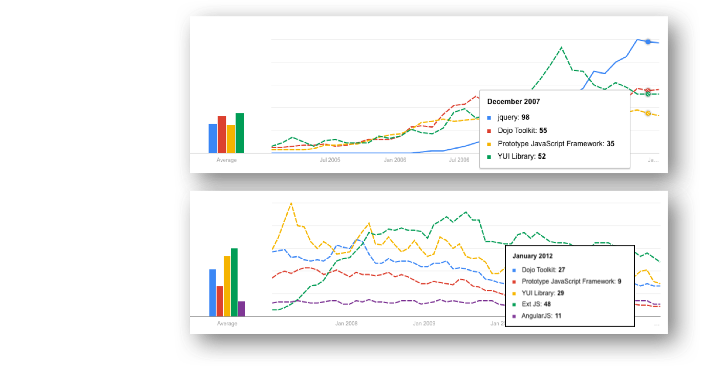

<!-- .slide: class="title" -->

###Choosing the Best
###JavaScript Framework for You
Rene Rubalcava ([@odoenet](https://twitter.com/odoenet)) & Raul Jimenez ([@hhkaos](https://twitter.com/hhkaos))

[github.com/odoe/presentations](https://github.com/odoe/presentations)

---

<!-- .slide: class="frameworks" -->

## The JS framework `MADNESS`


*Do I even need a framework??*

---

## Timeline: JS Frameworks & Libraries


---

## Trends: Interest over time



---

## Trends: 2004 - 2016


---

## So the quick answer is...

|Conservative|Hipsters|
|:---:|:---:|
| ||
|jQuery|React / Angular |

---

## Beyond the `cool-factor`


How is the learning curve?

---

## Evaluating a framework

* Documentation

* Features (pros & cons)

* Performance / weight / ...

* Programming style (MVC, event-driven, ...)

* Major version changes

* Dependencies: AMD vs. Browserify vs. Nothing

* Stability? (3rd party sponsorship)<br>
<small>Angular & Google, Dojo & Esri, ...<small>

---

## The community

* Stackoverflow questions

* For those hosted on Github:

  * Number of contributors

  * Number of open & closed issues

  * Number of open pull requests

  * Lastest commit date

---

## Project & team

Do not forget the most important thing!:
* `New` project or `expanding` existing project?
* Your project `expected lifetime`? (pilot, large project, ...)
* Your project `size`? (small, medium, large, ...)
* Do you have `existing build system`?
* Or `existing frameworks`?
* Your team `skill sets`?
* Your project `requirements`?

---

## Github projects

To build nice apps with ArcGIS API for JS 3.X:
* [angular-esri-map-v1](https://arcgis.github.io/angular-esri-map-site-v1/)
* [esri-leaflet](http://esri.github.io/esri-leaflet/examples/clustering-feature-layers.html)
* [calcite-maps](https://github.com/Esri/calcite-maps#whats-included) (Bootstrap)

---

## angular-esri-map-v1

```html
<esri-map id="map" map-options="map.options">
    <esri-vector-tile-layer
        url="//www.arcgis.com/sharing/rest/content/items/bf79e422e9454565ae0cbe9553cf6471/resources/styles/root.json">
    </esri-vector-tile-layer>
</esri-map>
```
[View live demo](https://arcgis.github.io/angular-esri-map-site-v1/#/examples/vector-tile-layer)

---

## esri-leaflet

```javascript
var map = L.map('map').setView([45.526, -122.667], 15);
L.esri.basemapLayer('Streets').addTo(map);

L.esri.Cluster.featureLayer({
  url: 'https://services.arcgis.com/rOo16HdIMeOBI4Mb/arcgis/rest/services/Trimet_Transit_Stops/FeatureServer/0'
}).addTo(map);
```
```html
<link rel="stylesheet" href="path_to_source/leaflet.css" />
<link rel="stylesheet" href="path_to_source/MarkerCluster.Default.css">
<link rel="stylesheet" href="path_to_source/MarkerCluster.css">
<!--
  scripts:
    - leaflet-src.js (L)
    - esri-leaflet@2.0.6 (L.esri)
    - leaflet.markercluster.js (L.markercluster)
    - esri-leaflet-cluster@2.0.0 (L.esri.Cluster)
-->
```
[View live demo](http://esri.github.io/esri-leaflet/examples/clustering-feature-layers.html)

---

## calcite-maps

```html
<body class="calcite-maps calcite-nav-top">

  <nav class="navbar calcite-navbar navbar-fixed-top calcite-text-light calcite-bg-dark calcite-bgcolor-dark-blue">
    <div class="calcite-title calcite-overflow-hidden">
      <span class="calcite-title-main">Map Title</span>
    </div>
  </nav>

  <div class="calcite-map calcite-map-absolute">
    <div id="mapViewDiv"></div>
  </div>

</body>
```
[View live demo](http://esri.github.io/calcite-maps/samples/index.html)

---

## Options available to you
 - [Templates](http://www.esri.com/software/arcgis-web-app-templates)
 - [Configurable Apps](http://www.arcgis.com/home/gallery.html#c=esri&t=apps&o=modified&f=configurable)
 - [Apps](http://www.esri.com/software/apps/)
 - Builders
  - [App Studio](http://appstudio.arcgis.com/)
  - [Web AppBuilders](http://www.esri.com/software/web-appbuilder)

---

## Templates
 - Easy to use
 - Configurable
 - Integrates with Portal

---

## Apps
 - Prebuilt with specific purpose ([Collector](http://www.esri.com/software/arcgis/collector-for-arcgis), [Navigator](http://www.esri.com/landing-pages/navigator))
 - Some provide extensibility ([Ops Dashboard](http://www.esri.com/software/arcgis/operations-dashboard-for-arcgis))

---

## Web AppBuilder
 - Can be thought of as its own framework
 - **jimu** - *the Lego framework*

---

## You need more?
### Or do you *want* more?

---

## Dojo can do the job


---

## Dojo already did that
<iframe width="560" height="315" src="https://www.youtube.com/embed/BY0-AI1Sxy0" frameborder="0" allowfullscreen></iframe>

---

## Framework Madness


---

## What problems do they solve?
 - Common theme is [Web Components](http://webcomponents.org/)
  - Web Components are not standardized *yet*
 - Some data binding mechanism

---

## What makes 4.x easier to use?
- Accessors
- View Models (*crème de la crème*)
- Maps and Views (`SceneView`, `MapView`)

---

## React


---

## React
- Not a framework
- Reusable, composable components
- JSX - declarative

---

```javascript
const view = new MapView({
  container: document.getElementById('viewDiv'),
  map,
  center: [-100.33, 25.69],
  zoom: 10,
  ui: { components: [] } // empty the UI
});
// Render the React Components
ReactDOM.render(
  <div>
    <Zoom view={view}/>
    <Attribution view={view}/>
    <BasemapToggle view={view} secondaryBasemap={'dark-gray'}/>
  </div>,
  document.getElementById('appDiv')
);
```

---

## React
- [Demo](https://github.com/odoe/esrijs4-vm-react)

---

## Angular 2


---

## Angular 2
- Directives are Web Components
- Dependency Injection
- *RxJS 5*

---

```typescript
import { Component } from 'angular2/core';
import { MapComponent } from './map.component';
import { HomeComponent } from './home.component';
@Component({
  directives: [MapComponent, HomeComponent],
    selector: 'my-app',
    template:
    `
    <div>
    <esri-map #mapView (viewCreated)="homeButton.setView(mapView.view)">
      <esri-home #homeButton></esri-home>
    </esri-map>
    </div>
    `
})
export class AppComponent { }
```

---

## Angular 2
- Some challenges
- Uses [SystemJS Module Loader](https://github.com/systemjs/systemjs)

---

## Well that's not going to work for us

```javascript
System.import('./local-module.js');

System.import('https://code.jquery.com/jquery.js');
```

---

## Angular 2
- Don't fight the loader, work around it

---

## Angular 2

```typescript
function register(name: string, mods: any[]) {
  System.register(name, [], exp => {
    return {
      setters: [],
      execute: () => {
        mods.map((mod: any, idx: number) => {
          exp(moduleName(deps[idx]), mod);
        });
      }
    }
  });
}
require(['esri/Map', 'esri/views/MapView'], function(...modules) {
  register('esri-mods', modules);
  System.import('app/boot');
});
```

---

## Packaged it up for you
- [esri-system-js](https://github.com/Esri/esri-system-js)

---

## Angular 2


---

## Angular 2
- [Demo](https://github.com/odoe/esrijs4-vm-angular2)

---

## Ember


---

## Ember
- The Ember Way
 - *Ember way or get out the way!*
- Focus on Web Components
- [ember-cli](http://ember-cli.com/)
 - Robust add-on system

---

## Ember
- Also had some challenges
- Uses it's own synchronous *AMD-like* loader
- Doesn't like RequireJS or Dojo loaders

---

## Ember
- So we wrote an addon to help with that
- [ember-cli-amd](https://github.com/esri/ember-cli-amd)

---

## Ember
### `ember install ember-cli-amd`

```javascript
var EmberApp = require('ember-cli/lib/broccoli/ember-app');
module.exports = function(defaults) {
  var app = new EmberApp(defaults, {
    amd :{
      loader: 'https://js.arcgis.com/4.2/',
      configPath: 'config/dojo-config.js',
      packages: [
        'esri','dojo','dojox','dijit',
        'put-selector','xstyle','dgrid'
      ]
    }
  });
  return app.toTree();
};
```

---

## Ember
- Map as a service

```javascript
// app/services/map.js
export default Ember.Service.extend({
  map: null,
  loadMap() {
    let map = this.get('map');
    if (map) return map;
    let graphicsLayer = new GraphicsLayer({ id: 'graphics' });
    let tileLayer = new VectorTileLayer({
      url: "https://www.arcgis.com/sharing/rest/content/items/f96366254a564adda1dc468b447ed956/resources/styles/root.json"
    });
    map = new Map({ layers: [tileLayer, graphicsLayer] }); // no display
    this.set('map', map);
    return map;
    }
  }
});
```

---

## Ember
- Map component

```javascript
//app/components/esri-map.js
export default Ember.Component.extend({
  classNames: ['viewDiv'],
  mapService: Ember.inject.service('map'),
  didInsertElement() {
    let map = this.get('map');
    if (!map) {
      map = this.get('mapService').loadMap();
      this.set('map', map);
    }
  },
  createView: function() {
    let map = this.get('map');
    let view = new MapView({
      map,
      container: this.elementId,
      center: [-100.33, 25.69],
      zoom: 10
    });
    view.then(x => this.set('view', x));
  }.observes('map') // similar to Accessor.watch
});
```

---

## Ember
- Using a ViewModel

```javascript
// app/components/esri-home.js
import Ember from 'ember';
import HomeVM from 'esri/widgets/Home/HomeViewModel';
export default Ember.Component.extend({
  classNames: ['home', 'action'],
  vm: null,
  createHome: function() {
    let view = this.get('view');
    let vm = new HomeVM({ view });
    this.set('vm', vm);
  }.observes('view'), // similar to Accessor.watch
  actions: {
    enable() {
      this.get('vm').goHome();
    }
  }
});
```

---

## Ember
- Compose your components

```hbs
//app/templates/index.hbs
{{esri-map view=view}}
{{esri-locate view=view}}
{{esri-home view=view}}
```

---

## Ember
- [Demo](https://github.com/odoe/esrijs4-vm-ember)

---

## VueJS
- [doc](https://vuejs.org/)

---

## VueJS
- Focus on components
- Not a big learning curve
- Virtual DOM

---

## VueJS

```js
// Create a Vue component
Vue.component("camera-info", {
  props: ["camera"],
  template: "<div>" +
            "<h2>Camera Details</h2>" +
            "<p><strong>Heading</strong>: {{ camera.heading.toFixed(3) }}</p>" +
            "<p><strong>Tilt</strong>: {{ camera.tilt.toFixed(3) }}</p>" +
            "<p><strong>Latitude</strong>: {{ camera.position.latitude.toFixed(2) }}</p>" +
            "<p><strong>Longitude</strong>: {{ camera.position.longitude.toFixed(2) }}</p>" +
            "</div>"
});
```

---

## VueJS

```js
view.then(function() {
  var info = new Vue({
    el: "#info",
    data: {
      camera: view.camera
    }
  });
  view.ui.add(info.$el, "top-right");
  view.watch("camera", function() {
    info.camera = view.camera;
  });
});
```

---

## Conclusion
 - 4.x Enhancements make integration easier
 - Pick a framework and dig in
 - Learn your tools

---

<!-- .slide: class="resources" -->

## Tons of resources 1/5

* Similar talks already recorded:
  * [2016 Video - Using Frameworks with the ArcGIS API for JavaScript](http://www.esri.com/videos/watch?videoid=5031&channelid=LegacyVideo&isLegacy=true&title=using-frameworks-with-the-arcgis-api-for-javascript)
  * [2015 Video - Picking a JS Framework ](http://www.esri.com/videos/watch?videoid=4279&channelid=LegacyVideo&isLegacy=true&title=choosing-the-best-javascript-framework-for-you)
  * [2014 Video - Working with Frameworks & ArcGIS API](http://www.esri.com/videos/watch?videoid=3334&channelid=LegacyVideo&isLegacy=true&title=working-with-javascript-app-frameworks-&-arcgis-api-for-javascript)

* Angular | Follow: [@tomwayson](https://github.com/tomwayson) & [@jwasilgeo](https://github.com/jwasilgeo) & [@dbouwman](https://github.com/dbouwman)
  * [2015 Video: Declarative Mapping Applications with AngularJS](http://www.esri.com/videos/watch?videoid=4321&channelid=LegacyVideo&isLegacy=true&title=declarative-mapping-applications-with-angularjs)
  * [Directives to help you use Esri maps and services in your Angular apps ](https://github.com/Esri/angular-esri-map)
  * [Esri-playground: Angular 2 & Esri 4](https://github.com/jwasilgeo/angular2-esri-playground)
  * [Ionic app demonstrating how to use the Esri ArcGIS API for JavaScript](https://github.com/jwasilgeo/ionic-esri-map)


---

<!-- .slide: class="resources" -->

## Tons of resources 2/5

* Leaflet | [@jgravois](https://github.com/jgravois) & [@patrickarlt](https://github.com/patrickarlt)
  * [2015 Video - Esri Leaflet: An introduction](http://www.esri.com/videos/watch?videoid=4314&channelid=LegacyVideo&isLegacy=true&title=esri-leaflet:-an-introduction)
  * [2015 Video - Esri Leaflet: Advanced Topics](http://www.esri.com/videos/watch?videoid=4315&channelid=LegacyVideo&isLegacy=true&title=esri-leaflet:-advanced-topics)
  * [2015 Video - Extend Esri Leaflet with Leaflet Plug-ins](http://www.esri.com/videos/watch?videoid=4420&channelid=LegacyVideo&isLegacy=true&title=extend-esri-leaflet-with-leaflet-plug-ins)
  * [Samples with AngularJS, Browserify, drag&drop, RequireJS, etc](https://github.com/Esri/developer-support/tree/gh-pages/web-leaflet)
  * [15 repos: esri-leaflet, esri-leaflet-geocoder, plugins, ...](https://github.com/search?q=org%3AEsri+leaflet)
  * [A leaflet plugin to display ArcGIS Web Map](https://github.com/ynunokawa/L.esri.WebMap)

* Bootstrap | Follow: [@alaframboise](https://github.com/alaframboise)
  * [2015 Video - Bootstrap: Taking Your Mapping UI and UX to the Next Level](http://video.esri.com/watch/4369/bootstrap-taking-your-mapping-ui-and-ux-to-the-next-level) – [PDF](http://proceedings.esri.com/library/userconf/devsummit15/papers/dev_int_154.pdf)
  * [A light-weight JS/CSS extension for to combine Bootstrap with ArcGIS JS (3.x) ](https://github.com/Esri/bootstrap-map-js)
  * [How to use our API for JavaScript (3.x) with Bootstap via Dojo-bootstrap](https://github.com/Esri/dojo-bootstrap-map-js)
  * [Calcite-maps: A modern framework for designing map apps with Bootstrap](https://github.com/Esri/calcite-maps)

---

<!-- .slide: class="resources" -->

## Tons of resources 3/5

* jQuery Mobile | Follow: [@andygup](https://github.com/andygup)
  * [Dynamically resizes map when used in multi-view apps](https://github.com/Esri/jquery-mobile-map-js)

* Knockout | Follow: [@snydercoder](https://github.com/snydercoder)
  * [Video 2015 - Building Map Apps with Knockout and the Esri JavaScript API](http://video.esri.com/watch/4539/building-map-apps-with-knockout-and-the-esri-javascript-api)
  * [DevSummit 2013: Knockout, backbone and Angular samples](http://driskull.github.io/framework-samples-js)

* Backbone | Follow: [@mjuniper](https://github.com/mjuniper)
  * [DevSummit 2013: Knockout, backbone and Angular samples](http://driskull.github.io/framework-samples-js)
  * [Video 2012 - Have a Little Backbone: An MVC JavaScript Framework for ...](http://video.esri.com/watch/1257/have-a-little-backbone-an-mvc-javascript-framework-for-your-next-generation-apps#sthash.FjPVzjoC.dpuf)

* Ember | Follow: [@ffaubry](https://github.com/ffaubry) & [@odoe](https://github.com/odoe) & [@dbouwman](https://github.com/dbouwman)
  * [Ember CLI Addon for using AMD libraries](https://github.com/Esri/ember-cli-amd)

---

<!-- .slide: class="resources" -->

## Tons of resources 4/5

* React | Follow: [@odoe](https://github.com/odoe) & [@tomwayson](https://github.com/tomwayson)
  * [EsriJS with React example](https://github.com/odoe/esrijs-react)
  * [Using ErsiJS 4.0 View Models with React](https://github.com/odoe/esrijs4-vm-react)
  * [ReactJS demo using BaconJS](https://github.com/odoe/reactflux)
  * [Demo app using ReactJS with Esri-Leaflet](https://github.com/odoe/reactmap)
  * [How to lazy load the ArcGIS API for JS in a react-router application](https://github.com/tomwayson/esri-react-router-example)

* Polymer | Follow: [@mjuniper](https://github.com/mjuniper)
  * [DevSummit 2015: A set of Esri web components built using the Polymer library](https://github.com/JamesMilnerUK/esri-polymer)
  * [DevSummit 2014: Mike Juniper Polymer demo](https://github.com/mjuniper/polymer-demo-ds2014)


---

<!-- .slide: class="resources" -->

## Tons of resources 5/5

* PhoneGap | Follow: [@andygup](https://github.com/andygup) & [@lheberlie](https://github.com/lheberlie)
  * [2015 Video: Native Apps using PhoneGap+jQuery+ArcGIS ](http://video.esri.com/watch/4293/arcgis-api-for-javascript-_dash_-building-native-apps-using-phonegap-and-jquery) – [PDF](http://proceedings.esri.com/library/userconf/devsummit15/papers/dev_int_170.pdf)
  * [ArcGIS JavaScript samples for use with PhoneGap/Cordova](https://github.com/Esri/quickstart-map-phonegap)

* Web AppBuilder | Follow: [@rscheitlin](https://github.com/rscheitlin) & [@tomwayson](https://github.com/tomwayson) & [gavinr](https://github.com/gavinr)
  * [Web AppBuilder Developer Resources](https://github.com/Esri/developer-support/tree/gh-pages/web-app-builder)

* CMV | Follow: [@tmcgee](https://github.com/tmcgee) & [@DavidSpriggs](https://github.com/DavidSpriggs)
  * [The Configurable Map Viewer - CMV](http://docs.cmv.io/en/1.3.4/)

* [Resources for the ArcGIS API for JavaScript](https://github.com/odoe/esrijs-resources)

---

<!-- .slide: class="questions centered" -->

## Questions?

**Help us to improve** filling out the survey


Rene Rubalcava ([@odoenet](https://twitter.com/odoenet)) & Raul Jimenez ([@hhkaos](https://twitter.com/hhkaos))

Slides: [github.com/odoe/presentations](https://github.com/odoe/presentations)

---

<!-- .slide: class="end" -->
#
